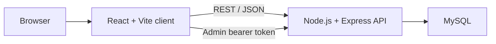

# Real Estate Platform

A full-stack real estate listing application built with React, Express, and MySQL. Visitors can discover properties and send enquiries, while authenticated staff manage listing content, image URLs, and enquiry status through a separate admin interface.

[GitHub repository](https://github.com/hoanglong212/real-estate-platform) · Demo video: add a verified 60–90 second walkthrough before applications

## Preview


## Core features

### Public experience

- Browse paginated property listings with server-side filters for location, price, listing type, category, status, and sort order.
- View property details, an image gallery, amenities, legal information, and related listings.
- Save favourites and recently viewed properties in browser storage without requiring an account.
- Submit general or property-specific contact enquiries to the REST API.
- Use responsive Vietnamese-language pages with loading, empty, and error states.

### Admin experience

- Sign in with a role-checked admin/editor account.
- Create, update, hide, and delete property listings.
- Add image URLs, choose a cover image, and delete images.
- Review contact enquiries and update their status to new, contacted, or closed.

The repository does not implement public user accounts, category CRUD, binary image uploads, payments, or map-based public search. Favourites and recent views are browser-local preferences.

## Architecture



| Path | Responsibility |
|---|---|
| `client/` | React Router pages, Tailwind-based responsive UI, public/admin components, API client, and browser-local preferences |
| `server/` | Express routes, validation, admin authentication, MySQL queries, schema, and migrations |
| `render.yaml` | Render Blueprint for the API web service and frontend static site |

The database schema contains `categories`, `users`, `properties`, `property_images`, and `contacts`. Foreign keys connect listings to categories and images, and preserve enquiries if a property is removed.

## Authentication and security notes

- Admin passwords use parameterised scrypt hashes. A tested SHA-256 compatibility path remains only for migrating older records; plaintext passwords are rejected.
- Admin bearer tokens are signed with HMAC-SHA256 and expire after seven days.
- `ADMIN_TOKEN_SECRET` is required at startup instead of falling back to a public default.
- SQL values use MySQL2 parameter placeholders, JSON bodies are size-limited, and CORS is configured by environment.
- Real `.env` files, editor database connections, dependencies, build output, logs, and local SQL sessions are ignored by Git.

This is a portfolio application, not a production identity system. Managed identity, password reset, refresh tokens, login rate limiting, audit logs, and CSRF-resistant cookie authentication would be required before handling real customer data.

## Technology

| Area | Tools |
|---|---|
| Frontend | React 19, React Router, Vite, Tailwind CSS, Lucide icons |
| Backend | Node.js, Express 5, MySQL2, dotenv, CORS, built-in crypto |
| Database | MySQL 8 schema and forward SQL migrations |
| Deployment | Render Blueprint: Node web service + static site |

## Local setup

### Prerequisites

- Node.js 20+
- npm
- MySQL 8+

### 1. Install dependencies

```bash
npm ci --prefix server
npm ci --prefix client
```

### 2. Configure the API

```powershell
Copy-Item server/.env.example server/.env
Copy-Item client/.env.example client/.env
```

Set a long random `ADMIN_TOKEN_SECRET` and your local MySQL connection values in `server/.env`. Keep both generated files untracked.

### 3. Create the database

Execute `server/db/schema.sql` in MySQL. Apply only the migrations that are not already represented in your database:

- `2026-03-07-add-amenities-column-to-properties.sql`
- `2026-03-07-property-amenities-and-optional-coords.sql`
- `2026-03-08-add-property-kind-and-legal-document.sql`

The SQL file creates structure only. Hosted portfolio deployment runs the idempotent
`npm run db:bootstrap` command, which creates the configured database when absent and adds three
clearly labelled fictional listings only when the listings table is empty. It never creates an
admin password.

### 4. Start both services

Terminal 1:

```bash
npm run dev --prefix server
```

Terminal 2:

```bash
npm run dev --prefix client
```

- Frontend: `http://localhost:5173`
- API: `http://localhost:5000`
- Health check: `http://localhost:5000/api/health`

The client uses `VITE_API_BASE_URL`; the API uses `PORT`, `DB_*`, `ADMIN_TOKEN_SECRET`, and `CORS_ORIGIN`.

## Verification

```bash
npm test --prefix server
npm run check --prefix server
npm run lint --prefix client
npm run build --prefix client
```

Latest verification on 23 August 2026:

| Check | Result |
|---|---|
| Password-hashing tests | 3 passed |
| Backend syntax check | Passed |
| Frontend ESLint | Passed |
| Frontend production build | Passed |
| Production dependency audit | 0 known vulnerabilities in server and client |
| Local read-only API smoke check | Health OK, 4 categories, 3 properties returned from the configured local MySQL database |

There is not yet an automated route/integration test suite for the complete REST API. The smoke result verifies the local API/database path, but it is not a substitute for endpoint-level regression tests.

## Deployment

`render.yaml` builds `server/` as a Node web service and `client/` as a static site. Render generates
the admin-token signing secret and wires the expected public origins. The API bootstrap is
idempotent, and hosted MySQL connections verify the provider CA supplied through `DB_SSL_CA`.
Configure current database credentials and the CA in Render before approving the first Blueprint
sync.

See [`DEPLOY.md`](DEPLOY.md) for the deployment checklist. No currently reachable live deployment is claimed in this README until the public URLs have been verified.

## My contribution

Repository history attributes the implementation to `hoanglong212`. I built and integrated:

- the responsive React public and admin interfaces
- the Express REST API and MySQL data model
- property filtering, detail, enquiry, and admin CRUD workflows
- URL-based image management and browser-local favourites/recent views
- environment-based deployment configuration and portfolio security cleanup

## Demo checklist

1. Start on the property listing and apply one location/type filter.
2. Open a property detail, change the gallery image, and favourite the listing.
3. Submit an enquiry using clearly labelled demo data.
4. Sign in as an admin, create or edit a demo listing, set its cover image, and show the enquiry status queue.
5. End on the repository structure and verification commands.

Use only non-sensitive demo accounts and data in screenshots or recordings. Add the final public demo and video links at the top of this README after checking them in a private browser window.

## Known limitations

- Admin image management stores external image URLs; it does not upload files.
- Favourites and recently viewed data are local to one browser.
- Admin authentication is appropriate for a portfolio demo, not public production.
- SQL migrations are manual and need an explicit migration ledger before multi-environment deployment.
- Automated REST route/integration tests and a verified public deployment are still pending.
- The repository does not currently declare an open-source licence.
